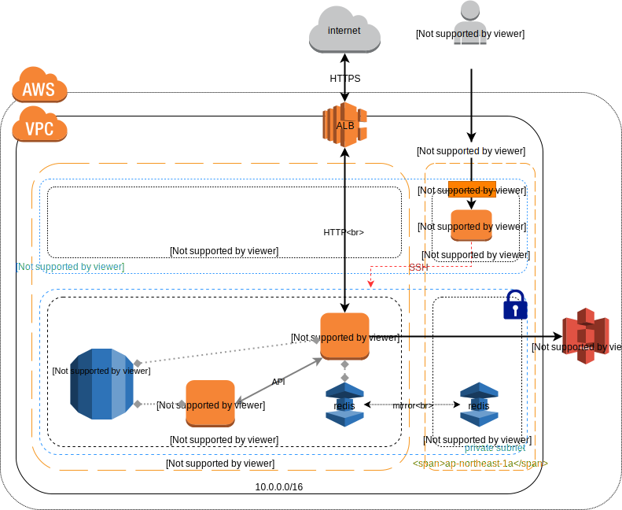

# Terraform
[terraform](https://www.terraform.io/)を使用してAWSのインフラ構成管理を行うテンプレート


## ファイル構成
- `main.tf` : 構成
- `override.tf` : 構成の上書きファイル
- `backend.tf.default` : backend設定のサンプル
- `output.tf` : 結果出力用設定
- `variables.tf` : 設定一覧
- `terraform.tfvars.default` : 設定のサンプル

## AWS構成
出来上がる構成は↓

- VPC ネットワークにパブリックとプライベートのサブネットを作成
- SSH の踏み台サーバ (bastion) をパブリックネットワーク内に配置  
  Elastic IP にて固定 IP を付与し、外部からのアクセスが可能な状態に  
  プライベートネットワークからはbastionを経由して外部と通信する
- Web のフロントに ALB を配置
- Web サーバは ALB 配下のプライベートネットワーク内に1台設置
- Web アプリケーションのセッション管理等を ElasticCache の redis にて行う想定
- API サーバはプライベートネットワーク内にに1台設置
- RDS の mysql を1台設置


## 初期設定  
terraformはインストール済みの環境とします。  
インストール方法に関しては[こちら](https://www.terraform.io/intro/getting-started/install.html)

**AWS ACCESS_KEY_ID / SECRET_ACCESS_KEY の設定**

`~/.aws/credentials` に [プロファイル名] スコープを定義してkey/secret を管理します。

```
$ cat ~/.aws/credentials
[%PROFILE_NAME%]
aws_access_key_id=XXXXXXXXXXXXXXXXXXXX
aws_secret_access_key=xxxxxxxxxxxxxxxxxxxxxxxxxxxxxxxxxxxxxxxx
```

**terraform.tfvars の準備**

`terraform.tfvars.default` を `terraform.tfvars` としてコピーし内容を編集します。

```
$ cd /path/to/project/infra/terraform
$ cp terraform.tfvars.default terraform.tfvars
$ vim terraform.tfvars
 :
 :
```

**terraform init**

terraformのbackendがすでに初期化済みの場合 (s3バケットが作成済みの場合)


```
$ cp backend.tf.default backend.tf
$ terraform init
```

terraformのbackendの初期化が済んでいない場合

```
$ terraform init
$ terraform apply -target=aws_s3_bucket.terraform

An execution plan has been generated and is shown below.
Resource actions are indicated with the following symbols:
  + create

Terraform will perform the following actions:

  + aws_s3_bucket.terraform
      id:                          <computed>
      acceleration_status:         <computed>
      :
      :

Plan: 1 to add, 0 to change, 0 to destroy.

Do you want to perform these actions?
  Terraform will perform the actions described above.
  Only 'yes' will be accepted to approve.

  Enter a value: yes <---

aws_s3_bucket.terraform: Creating...
  acceleration_status:         "" => "<computed>"
  acl:                         "" => "private"
  :
  :

aws_s3_bucket.terraform: Creation complete after ...

Apply complete! Resources: 1 added, 0 changed, 0 destroyed.

$ cp backend.tf.default backend.tf
$ vim backend.tf
$ terraform init

Initializing the backend...
Do you want to copy existing state to the new backend?
  Pre-existing state was found while migrating the previous "local" backend to the
  newly configured "s3" backend. No existing state was found in the newly
  configured "s3" backend. Do you want to copy this state to the new "s3"
  backend? Enter "yes" to copy and "no" to start with an empty state.

  Enter a value: yes <---


Successfully configured the backend "s3"! Terraform will automatically
use this backend unless the backend configuration changes.

Initializing provider plugins...

Terraform has been successfully initialized!

```


## 使用方法
[ドキュメントはこちら](https://www.terraform.io/docs/commands/index.html)

### 反映する構成を確認
変更点を差分表示します。

```
$ terraform plan
```

### 構成を反映する
変更点を実際に反映します。

```
$ terraform apply
```

### ftファイルのフォーマット

```
$ terraform fmt
```
